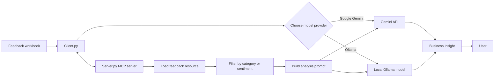

# Enhanced Feedback Analytics

## Goal

This project is designed to help hotel teams analyze customer feedback and turn raw review data into actionable business insights. The system reads a feedback workbook, filters responses by category and sentiment, and then uses a language model to answer executive-style questions such as:

- What are customers saying about billing?
- Which areas have the most negative feedback?
- Are there recurring issues in room quality or customer support?
- What improvements should the hotel prioritize?

The goal is to combine structured data with AI-driven reasoning so non-technical stakeholders can ask natural-language questions and receive concise, business-focused answers.

## Architecture

The project follows a lightweight client-server architecture built around the Model Context Protocol (MCP):

### 1. Data layer
- `create_feedback_workbook.py` generates a workbook named `hotel_booking_feedback.xlsx`.
- The workbook contains hotel booking feedback records with columns such as:
  - Feedback ID
  - Date
  - Category
  - Rating
  - Feedback
  - Sentiment
- This dataset acts as the persistent source of truth for the analytics system.

### 2. MCP server layer
- `Server.py` defines the FastMCP server.
- It exposes:
  - a resource: `feedback://get_feedback_list`
  - tools: `get_feedback_by_category` and `get_feedback_by_sentiment`
  - a prompt: `get_prompt`
- The server loads the Excel workbook, converts it to JSON, and provides filtered access to the data for downstream analysis.

This is the business logic layer that standardizes how the client fetches and filters feedback without exposing raw spreadsheet details to the user.

### 3. Client layer
- `Client.py` is the user-facing application.
- It allows the user to choose between:
  - Google Gemini
  - Ollama
- The client connects to the MCP server, retrieves relevant feedback, builds a prompt, and sends it to the selected LLM.
- The LLM then generates a natural-language executive summary based on the filtered feedback.

### 4. LLM integration
- The application supports two model providers:
  - Google Gemini via the `google.genai` client
  - Ollama via `mcp_client_for_ollama`
- The selected provider receives a structured prompt that includes the business question and the relevant filtered feedback data.

### 5. Supporting validation script
- `Test.py` is a helper/test script used to inspect the worksheet and verify the dataset structure and contents.

## Project Flow

1. The workbook is generated or loaded from disk.
2. The `Server.py` MCP server exposes feedback as JSON-based resources and tools.
3. The `Client.py` app asks the user for a query and a provider.
4. The client fetches the relevant dataset and applies category/sentiment filters.
5. A prompt is created using the filtered feedback.
6. The LLM answers the question in plain business language.
7. The user receives a concise summary or recommendation, without seeing the technical workflow.

### Flow chart



## Files in the project

- `Client.py` — conversational frontend and orchestration logic
- `Server.py` — MCP server and data access layer
- `create_feedback_workbook.py` — generates the hotel feedback workbook
- `Test.py` — dataset verification and debugging helper
- `requirements.txt` — Python dependencies
- `hotel_booking_feedback.xlsx` — generated feedback dataset

## Typical use case

A hotel manager can ask questions like:

- Why are customers unhappy with the booking experience?
- Which category has the highest negative sentiment?
- Are room issues concentrated in cleanliness, comfort, or amenities?
- What customer support problems are most common?

The system translates those questions into filtered feedback analysis and returns answerable business insights.

## Setup

1. Install dependencies:
   ```bash
   pip install -r requirements.txt
   ```

2. Ensure the workbook exists. If not, generate it with:
   ```bash
   python create_feedback_workbook.py
   ```

3. Configure your environment variables for the chosen LLM provider, such as:
   - `GEMINI_API_KEY`
   - `GEMINI_MODEL`
   - `OLLAMA_HOST`
   - `OLLAMA_MODEL`

4. Run the client:
   ```bash
   python Client.py
   ```

## Notes

This project is a demonstration of combining:
- structured business data,
- an MCP-based tool layer,
- and AI-powered natural-language analysis.

It is best suited for internal decision support, not as a full production analytics platform.
